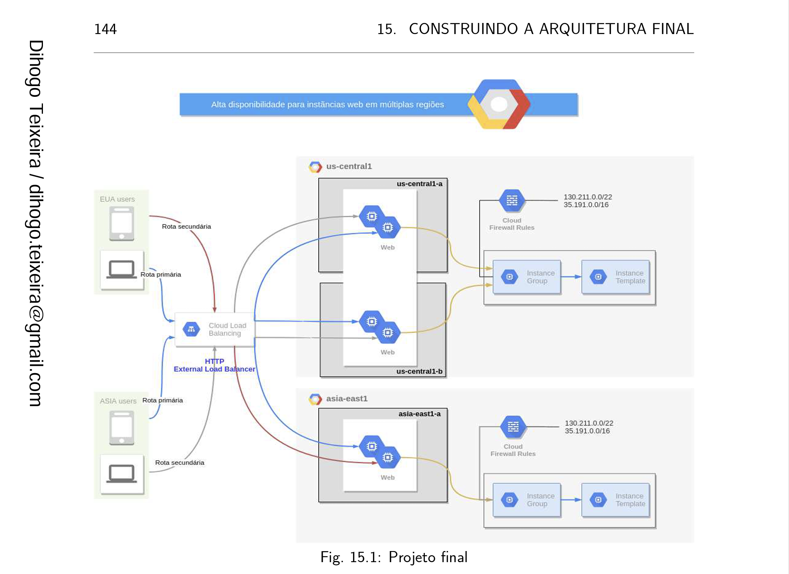

#### INSTALANDO TERRAFORM

1. [Terraform Install](https://www.terraform.io/downloads.html "Terraform Install")

Referência na apostila: `PÁGINA: 18`

---
#### CRIANDO SUA CONTA GCP

2. [Create GCP account](https://cloud.google.com "Create GCP account")

---
#### VSCODE DOWNLOAD (OPCIONAL)

3. [VSCode Download](https://code.visualstudio.com/download "VSCode Download")

---
#### PROJETO FINAL

Referência na apostila: `PÁGINA: 144`

---