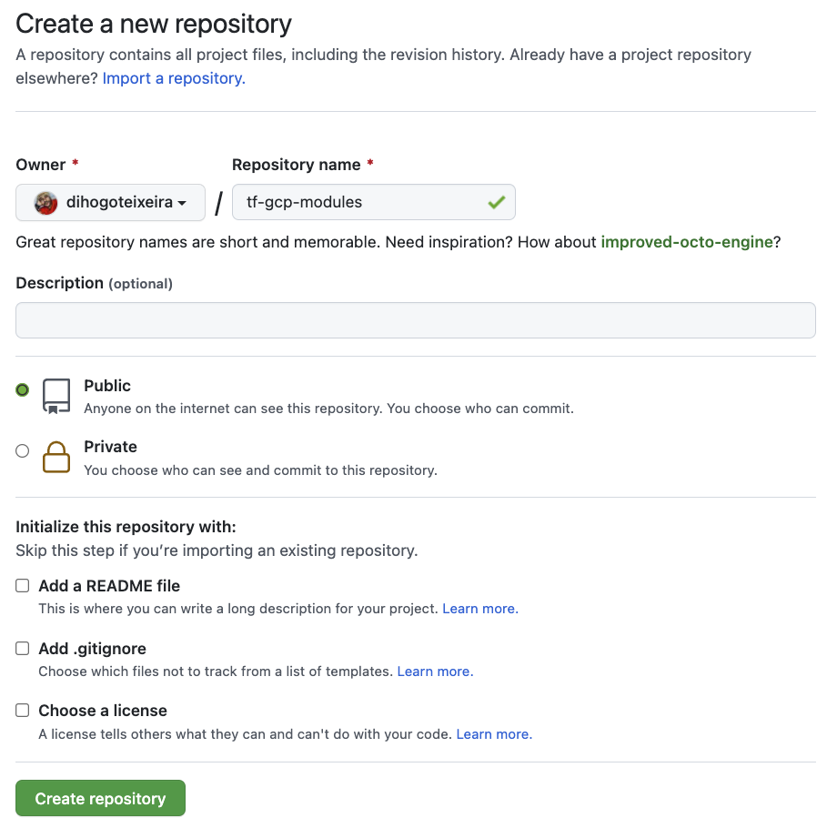
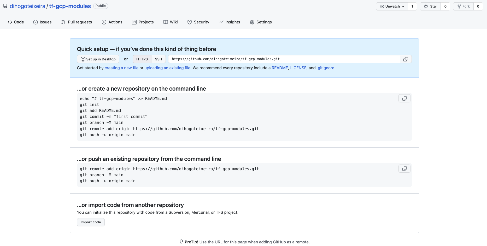

Topcs:

1. Remote State
2. Creating a Local Modules
3. Using local Modules
4. Creating GitHub repository
5. Versioning Module
6. Using remote Modules
7. Demo

---
#### NOTA

Não iremos abordar instalação de Git em sua máquina ou criar uma conta no GitHub, ambos os processos são simples e certamente você saberá fazer o processo.

Porém, caso este seja seu primeiro contato com Git e repositórios, vamos detalhar algumas coisas.

---

#### CRIANDO UM REPOSITÓRIO NO GITHUB

Preencha os campos conforme exemplo abaixo. Sempre coloque nomes que representem o propósito do projeto.



Para os exemplos foi criado um repositório chamado **tf-gcp-modules**



Neste podemos configurar de duas maneiras distintas, clonando o repositório vazio ou criando estrutura diretamente na sua máquina, mas iremos prosseguir apenas clonando o repositório vazio.

Faça o clone do seu repositório.
```sh
$ git clone https://github.com/dihogoteixeira/tf-gcp-modules.git
```

Para enviarmos nosso código fonte para este projeto precisaremos configurar nossa chave `SSH`.

---

#### CRIANDO CHAVES SSH

Chaves públicas estabelecem de forma confiável a comunicação de sua máquina com o seu repositório, o GitLab é o método mais utilizado para `enviar/receber` arquivos de um repositório.

Para quem já utiliza chaves públicas, é possível utilizar a mesma, ou criar outra.

O comando para criar está abaixo. Quando solicitado para inserir senhas, apenas pressione `ENTER` :
```sh
$ ssh-keygen -t rsa -b 4096
```

Para aqueles que queiram criar outra chave:
```sh
$ ssh-keygen -t rsa -b 4096 -f ${HOME}/.ssh/4linux
```

Para ambos os processos, a saída será similar.
```sh
Generating public/private rsa key pair.
Enter passphrase (empty for no passphrase):
Enter same passphrase again:
Your identification has been saved in /home/diteixeira/.ssh/4linux.
Your public key has been saved in /home/diteixeira/.ssh/4linux.pub.
The key fingerprint is:
SHA256:mtABqryIABsxIw4YmnKBL55mqC2rREHIhfFRpuotTqI diteixeira@4linux
The key's randomart image is:
+---[RSA 4096]----+
|@==ooo           |
|XB.o+.           |
|*+oo  .          |
|==+  . .         |
|*=. . . S        |
|B=o  . o         |
|BB .  o          |
|O o              |
|E+               |
+----[SHA256]-----+
```
---

#### ADICIONANDO AS CHAVES NA SUA CONTA DO GITHUB

Precisamos copiar o conteúdo desta chave gerada para comunicar com o GitHub. 
Este processo além de utilizar criptografia, nos permite realizar `commits` sem que seja necessário a cada momento informar usuário e senha ao sistema.

Copie o conteúdo da chave pública:
```sh
$ cat ${HOME}/.ssh/4linux.pub
```

Vá até o GitHub e clique em [https://github.com/settings/profile](https://github.com/settings/profile) e no menu esquerdo selecione `SSH and GPG Keys`, colando o conteúdo da chave no formulário `New SSH Key`.

Para aqueles que estão utilizando uma segunda chave: deverá ser criado um arquivo dentro do seu `${HOME}` para suportar a outra chave.

Crie um arquivo chamado de `config` em `${HOME}/.ssh`:
```sh
$ vim ${HOME}/.ssh/config
````

Adicione o seguinte conteúdo abaixo:
```sh
  Host github.com
  HostName github.com
  User git
  IdentityFile ~/.ssh/4linux
  IdentitiesOnly yes
```

- Entre no diretório do módulo que foi criado juntamente com seu instrutor.
- Faça um teste criando um arquivo chamado README.md.

```sh
$ echo "Módulo para gerenciamento de instâncias para Google Cloud Platform" > README.md
```

Verifique o arquivo com o comando:
```sh
$ git status
```

Você deverá receber um resultado com o seguinte resultado:
```sh
On branch master

No commits yet

Untracked files:
  (use "git add ..." to include in what will be committed)

	README.md
	main.tf
	variables.tf
nothing added to commit but untracked files present (use "git add" to track)
```

Adicione o arquivo com:
```sh
$ git add README.md
```

Faça o commit do arquivo:
```sh
$ git commit -m 'Envio do arquivo README.md para teste de autenticação'
```

Talvez aparecerá a seguinte mensagem no seu terminal. Esta mensagem irá aparecer caso você não tenha em modo global dizendo quem você é:
```sh
*** Please tell me who you are.

Run

  git config --global user.email "you@example.com"
  git config --global user.name "Your Name"

to set your account's default identity.
Omit --global to set the identity only in this repository.

fatal: unable to auto-detect email address (got 'diteixeira@meli.(none)')
```

Preste atenção no parâmetro `–global` do git, aqui é configurado para todo o seu sistema utilizar sempre os mesmos valores, porém não é aconselhado caso tenha mais de uma credencial. 
Este caso de ter mais de uma credencial acontece quando você faz commit com mais de uma conta de email, como por exemplo projetos pessoais e projetos da empresa no mesmo computador, fique atento!
```sh
$ git config user.name "Nome"
$ git config user.email "email@dominio"
```

Uma vez configurado informado os valores para o seu nome e email repita o comando de commit.
```sh
$ git commit -m 'Envio do arquivo README.md para teste de autenticação'
```

Com o seguinte resultado:
```sh
On branch master
Your branch is based on 'origin/master', but the upstream is gone.
  (use "git branch --unset-upstream" to fixup)

nothing to commit, working tree clean
```

Faça o envio do arquivo:
```sh
$ git push origin master
```

Com o seguinte resultado:
```sh
Enumerating objects: 3, done.
Counting objects: 100% (3/3), done.
Writing objects: 100% (3/3), 296 bytes | 296.00 KiB/s, done.
Total 3 (delta 0), reused 0 (delta 0)
To git@github.com:dihogoteixeira/tf-gcp-modules.git
 * [new branch]      main -> main
```

Neste último comando, origin é o nome padrão do git para uma conexão e master é o nome do branch padrão de qualquer repositório git, porém tudo isto é configurável no seu repositório, caso seja necessário.

Verifique no Github o envio de seu código.

Envie agora o arquivo `main.tf` e `variables.tf`
```sh
$ git add main.tf variables.tf
```

Faça o commit:
```sh
$ git commit -m 'Envio de projeto'
```

Faça o envio para o repositório:
```sh
$ git push origin master
```

Com os comandos acima você irá enviar todos os arquivos para o repositório e assim ele poderá ser consumido por todos.

---

#### VERSIONANDO MODULOS

Para começar de fato a versionar um módulo de maneira apropriada, devemos criar uma tag utilizando git para fazer uma marcação no tempo.

```sh
$ git tag -a v1.0 -m 'Versão 1.0 que realiza a criação de múltiplas máquinas'
```

Confirme sua tag com o comando:
```sh
$ git tag
```

Com a saída:
```sh
v1.0
```

Envie a tag para o repositório:
```sh
$ git push --tags
```

Com o seguinte resultado:
```sh
Enumerating objects: 1, done.
Counting objects: 100% (1/1), done.
Writing objects: 100% (1/1), 205 bytes | 205.00 KiB/s, done.
Total 1 (delta 0), reused 0 (delta 0)
To git@github.com:dihogoteixeira/tf-gcp-modules.git
 * [new tag]         v1.0 -> v1.0
```

Devemos alterar nosso código que consome este módulo para utilizar a nova `tag`.